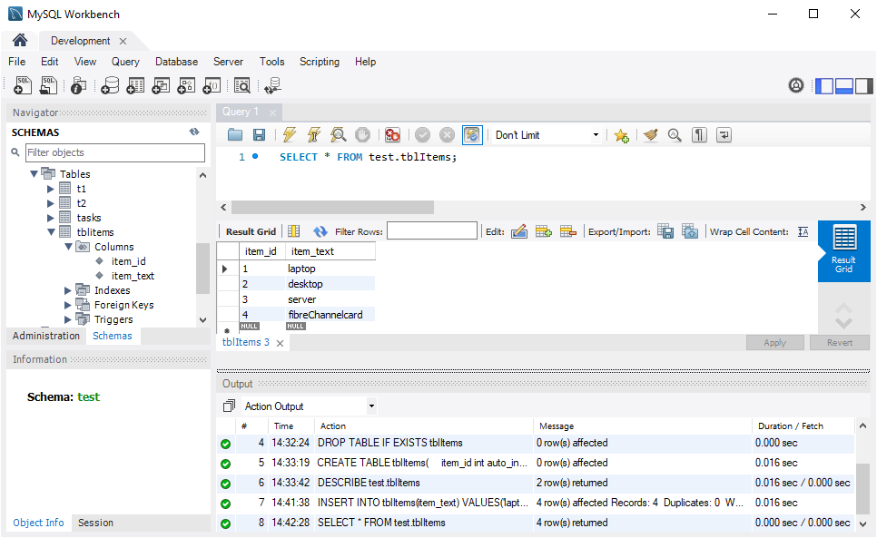

## 2.1 Query Numeric Data from MySQL Tables

Properly defining data types in a table is an important aspect of database  administration. Only define the data type and the data size that is needed for the table. For example, take the customer table for the coffee shop. You only need to define string type for the state in a table, and the size should be no more than 20. MySQL data types are broken down into three categories.

- Numeric
- Date and Time
- String Types.

In the video below, you learn that MySQL is one of the most popular database management systems for small- to medium-sized web projects. In this course, Bill Weinman provides clear, concise tutorials that guide you through creating and maintaining a MySQL database of your own. Bill explores the basic syntax, using SQL statements to insert, update, and delete data from your tables. He also covers creating a new database from scratch, as well as working with data types, operators, and string and mathematical functions. Plus, learn about the key differences between standard SQL and SQL as implemented by MySQL.

Weinman, B. (2019, July 16). *[What are Data Types? - MySQL Essential Training](https://www.linkedin.com/learning/mysql-essential-training-2/what-are-data-types)*. LinkedIn.

### **Numeric Data Types**

The numeric data types are based on the American National Standards Institute (ANSI) standard, which means they are interchangeable for other database systems. Some of the common numeric data types are listed below.

| Data Type    | Specification (signed)                                | Specification (unsigned)  | Width           |
| ------------ | ----------------------------------------------------- | ------------------------- | --------------- |
| INT          | -2147483648 to 2147483648 (integer)                   | 0 to 4294967295           | Up to 11 digits |
| TINYINT      | -128 to 127 (integer)                                 | 0 to 255                  | Up to 4 digits  |
| SMALLINT     | -32768 to 32767 (integer)                             | 0 to 65535                | Up to 5 digits  |
| MEDIUMINT    | -8388608 to 8388607 (integer)                         | 0 to 16777215             | Up to 9 digits  |
| BIGINT       | -9223372036854775808 to 9223372036854775807 (integer) | 0 to 18446744073709551615 | Up to 20 digits |
| FLOAT (M,D)  | Default 10,2 (2 is the number and 10 is decimal)      | N/A                       | Up to 20 digits |
| DOUBLE (M,D) | Default 16,4 (4 is the number and 16 is decimal)      | N/A                       | Up to 20 digits |

*Table 1: A table listing some of the common numeric data types.*

MySQL numeric types include types for integer, fixed-point, and floating-point real numbers. Integer types are used for storing numbers that don't have a fractional part. There are five integer types in MySQL, and they differ only on the scale of the values they represent. This table shows the storage requirements and scales for the various integer types. Note that *INT* is an alias for integer so when you see *INT* or integer they mean the same thing. The SQL standard is an integer, but MySQL, like most database systems, recognizes int as the same type.

The decimal type is used for fixed precision values. The type declaration for decimal takes two parameters. The first parameter is the precision that specifies the number of digits that will be stored. This number includes the digits after the decimal point. The second parameter is the scale, this specifies the position of the decimal point. Zero means no decimal point. For example, this declaration has a 9 for precision and a 2 for scale, so there are nine significant digits. And the decimal point is in the second position.

### **MySQL *INT***

*INT* stands for *integer*, as you know. Also, integers are whole numbers; that is, they do not contain decimal points. Integers can be less than zero, zero, or greater than zero. MySQL classifies integers into different ranges to accommodate different types of computer architectures and optimal storage and querying of large databases. Integers may be signed or unsigned. The classification of MySQL integers is the following:

- small,
- tiny,
- medium, and
- big.

A common use of integers in MySQL is for primary keys in MySQL tables. Here are a brief notes on primary keys.

- A primary key is a column or a set of columns in a table that uniquely identifies each row in the table.
- A primary key is a *tuple* of one or more columns, and each tuple is distinct.
- A primary key consisting of multiple columns cannot have a null value for any one of its members; thus, when you create a table column with the intent of that column being part of a primary key, then you must add the attributes *NOT NULL* to the column definition.
- A table has only one primary key.

A special type of integer is the *AUTO_INCREMENT* integer. When a table has this special type of integer, any insertion of a new row into that table causes the value of that integer to increase by a prescribed amount (not necessarily one). An AUTO_INCREMENT field instructs MySQL to generate a unique sequence; e.g., 1,2,3,4,5,6…, that could serve as a primary key for a table. The AUTO_INCREMENT field has the functionality such that when you insert a *NULL* value or 0 into a AUTO_INCREMENT column, then the value of the column is set to the next sequence value. When you insert a value other than *NULL* or 0, then the MySQL database engine resets the AUTO_INCREMENT sequence to the next value of the inserted value.

Set up the test database for this section by executing the following queries:

```MySQL
# Creates the test database if it does not exist.
CREATE DATABASE IF NOT EXISTS test DEFAULT CHARACTER SET utf8;

# Defines the test database as the active schema.
USE test;

# Deletes any existing tblItems table from the test database.
DROP TABLE IF EXISTS tblItems;
```

Examine the following sequence of SQL statements.

```mysql
CREATE TABLE tblItems(
    item_id int auto_increment PRIMARY KEY,
    item_text varchar(50)
);
```

Next, describe the tblItems table you just created:

```mysql
DESCRIBE test.tblItems;
```

You should see the following results from MySQL Workbench.


*Figure 1: table descriptiopn for test.tblItems*

Note that both INT and INTEGER mean the same thing in the CREATE table statement. Whenever you insert a record in the above table, the item_id field will increase by one. You should try this in your MySQL workbench. Next, try the following insert statement.

```mysql
INSERT INTO tblItems(item_text)
VALUES('laptop'), ('desktop'), ('server'), ('fibreChannelcard');
```

Finally, select the data from tblItems:

```mysql
SELECT * FROM test.tblItems;
```

You should see the following results from MySQL Workbench.



*Figure 2: data from the test.tblItems table.*

The output of the select statement shows the auto_increment sequence starting at one. You can override the next sequential value so that it will not be five. Try running the following insert statement to change the sequence values.

```MySQL
INSERT INTO tblItems(item_id, item_text)
VALUES (13, 'docking station');
```

Select the data again and note the next sequence value for *item_id* is 13, not five. The next sequence value will be 14. As a final note to this topic, auto_increments can only be positive integers.


*Figure 3: updated data from the test.tblItems table.*

In some query problems you may have to work with, such as creating reports or grid views on a webpage, you may have to restrict the number of spaces that an integer data type is displayed in. The display width is wrapped inside parentheses following the *INT* keyword; e.g., *INT(6). INT(6)* will return the integer value of the field and that integer value will be formatted in any display to occupy six spaces with a leading pad character if necessary. Note that this is a text formatting property and not a numeric range property. You use this width specifier to “pad” the display of an integer. For instance, if you use the *ZEROFILL* option to pad an integer display with zeros and if the number of digits in an integer is less than its width specifier, then the display will pad the width with leading zeros. 

Run the following SQL statements and select the data from tblItems. Note the zero paddings in the result set.

```mysql
USE test;
DROP TABLE IF EXISTS tblItems;

CREATE TABLE tblItems(
    item_id int auto_increment PRIMARY KEY,
    int_1 int(2) zerofill,
    int_2 int(4) zerofill,
    item_text varchar(255)
);
INSERT INTO tblItems(int_1, int_2, item_text)
VALUES(3, 14, 'docking station');

SELECT * FROM tblItems;
```

### **The MySQL DECIMAL Data Type**

Decimal data types in MySQL tables store exact numeric values. They are typically used to represent monetary values in accounting systems. Use the following syntax to define a decimal data type;

```mysql
column_name DECIMAL(P,D) 
```

- **P** stands for precision and it represents the number of significant digits. The values of P are from 1 to 65.

- **D** represents the number of digits after the decimal point. The values of D are from 0 to 30. 

   `DECIMAL(P, D)`

   means that the table column can store up to P digits with D decimals. Synonyms for DECIMAL include the following:

  - DEC,
  - FIXED, and
  - NUMERIC

As an example, consider the following column definition for a table:

```mysql
cost decimal(5,2);
```

In that statement, the *cost* column can store five digits with two decimal places, which means the range of the cost column is from -999.99 to 999.99.

Practice the following SQL statements in your MySQL Workbench. Note the format of the decimal outputs.

```mysql
USE test;
DROP TABLE IF EXISTS tblItems;

CREATE TABLE tblItems
(
    id int auto_increment PRIMARY KEY,
    item_desc varchar(124),
    cost decimal(14, 4) NOT NULL
);

INSERT INTO tblItems(item_desc, cost)
VALUES('hatchet', 110.96), ('axe', 35.95), ('saw', 9.15);
 
SELECT * FROM tblItems;
```

Change the decimal data type:

```mysql
ALTER TABLE tblItems
MODIFY cost decimal(15,5) zerofill; 
# Modify the line above in different ways and view the results.
 
SELECT * FROM tblItems;
```


## 2.2 Date and Time Types

| Data Type | Specification (signed)                                       |
| --------- | ------------------------------------------------------------ |
| DATE      | YYYY-MM-DD                                                   |
| DATETIME  | YYYY-MM-DD HH:MM:SS                                          |
| TIMESTAMP | YYYY-MM-DD HH:MM:SS <br>Stored internally as a UNIXTIME integer, -2147483648 to 2147483647 <br>1970-01-01 00:00:00 to 2038-01-19 03:14:17 |
| TIME      | HH:MM:SS                                                     |
| YEAR      | YYYY (1901 to 2155)                                          |

In this video,  Bill Weinman explains that MySQL supports a complete set  of date and time types. These include date, time, a standalone year  type, and a combined date-time type, and a timestamp that's  automatically updated when a row is created or updated.

Weinman, B. (2019, July 16). *[Date and Time Types - MySQL Essential Training](https://www.linkedin.com/learning/mysql-essential-training-2/what-are-data-types)*. LinkedIn.

MySQL supports a complete set of date and time objects. These include the  date, time, a standalone year type, a combined datetime type, and a  timestamp type that's automatically updated when a row is created or  updated. 

MySQL stores dates and times in standard SQL  format. Standard SQL format for dates and times is designed for  convenient sorting and searching. Different countries and locales have  different localized formats for dates and times. Some with the year to  the left, some with the year to the right. Some are in odd, mixed-up  orders like the month-day-year format common in the United States.

SQL format has the most significant  parts to the left and the least significant parts to the right. This  makes sorting and searching much easier, so you may even find it useful  in other contexts such as  in spreadsheets and file names. MySQL has  comprehensive time zone support that's based on the intensive time zone  database maintained by the internet assigned numbers authority (IANA).  The IANA time zone database is a standard set of international time zone rules for names and locations.

// todo TEST ALL AFTER THIS

Run the following SQL statements and view the selected data from tblItems.

```mysql
# Delete the tblItems table for the next exercise.
USE test;
DROP TABLE IF EXISTS tblItems;

CREATE TABLE tblItems
(
    datetime_now datetime
);    
INSERT INTO tblItems(datetime_now)
VALUES(NOW());

SELECT * FROM tblItems;
```

Run the following statement to see various Date and Time Types.

```mysql
SELECT date(datetime_now) AS 'DATE', 
       datetime_now AS 'DATETIME', 
       timestamp(datetime_now) AS 'TIMESTAMP', 
       cast(datetime_now as unsigned) AS `TIMESTAMP as INTEGER`,
       time(datetime_now) AS 'TIME', 
       year(datetime_now) AS 'YEAR' 
FROM tblItems;
```

## 2.3 String Types

| Data Type              | Specification (signed)                       |
| ---------------------- | -------------------------------------------- |
| CHAR                   | A string from 0 to 255 characters – Fixed    |
| VARCHAR                | A string from 0 to 255 characters - Variable |
| TEXT, BLOB             | A string from 0 to 65535 bytes               |
| TINLYBLOB or TINYTEXT  | A string from 0 to 255 bytes                 |
| MEDIUMTEXT, MEDIUMBLOB | A string from 0 to 16777215 bytes            |
| LONGTEXT, LONGBLOB     | A string from 0 to 4294967295 bytes          |
| ENUM                   | A list of items                              |
| SET                    | A list of distinct items                     |

In this video, you see that SQL provides string types for a variety of  purposes. Character strings are used to store text-based strings. Binary strings, store non-text-based data. Fixed length strings are padded and always use the same amount of storage. While variable length strings  use less storage, when the strings are shorter. And large object storage is used for storing documents and media files and other large objects.

Weinman, B. (2019, July 16). *[String Types - MySQL Essential Training](https://www.linkedin.com/learning/mysql-essential-training-2/string-types)*. LinkedIn.

MySQL  provides string types for a variety of purposes. Character strings are  used to store text-based strings. Binary strings store non-text based  data. Fixed-length strings are padded and always use the same amount of  storage. Variable-length strings use less storage when the strings are  shorter, and large object storage is used for storing documents and  media files. Character strings come in two varieties. The CHAR string is a fixed-length string.

### **The MySQL *CHAR* Data Type**

In MySQL, the *CHAR* data type represents a fixed-length string of characters. When you declare a table column of type *CHAR* it is customary to supply a string length; e.g., *CHAR(15)* represents a character string between zero and 15 characters in length. The maximum length of a *CHAR* data type is 255 characters. When you store a *CHAR* value, the MySQL database engine will pad the string with leading  spaces up to the length you declared if the data value is less than your specified length. When you select *CHAR* data from a table that has space padding, MySQL will strip the leading spaces. MySQL will not strip trailing spaces by default.

The following are examples of MySQL SQL statements using the  CHAR data type. You should investigate these queries in your MySQL  Workbench.

```mysql
# Delete the table for the next exercise.
USE test;
DROP TABLE IF EXISTS tblItems;

CREATE TABLE tblitems(
    x char(3)
);

INSERT INTO tblItems(x)
VALUES ('yes'), ('no');
 
# You use the LENGTH function to get the length of a character string.
SELECT x, length(x) FROM tblItems;
```

The following statement will add ' Y' to the table and ignore the trailing space.

```mysql
INSERT INTO tblItems(x)
values(' Y ');

SELECT x, length(x) FROM tblItems;
```

MySQL by default does not consider trailing spaces when  comparing CHAR strings. The comparison operators for strings include the following:

- =
- <>
- \>
- < 

MySQL also uses a *LIKE* operator to compare strings. For more information on the use of LIKE, see Wikibook. (2020, October 31). *[MySQL/Language/Operators#Like]( https://en.wikibooks.org/wiki/MySQL/Language/Operators#LIKE)*. en.wikibooks.org. 

The following SQL query will not return any results. Do you know why?

```mysql
SELECT * FROM tblItems
    WHERE x LIKE 'Y';
```

Can you fix this query using *LIKE* to make the query return a result? 

```mysql
SELECT * FROM tblItems
    WHERE x LIKE ' Y';
```

If your *CHAR* column has a *UNIQUE* index, and if you attempt to insert a value that is different from an existing  value in the number of trailing spaces, then MySQL will reject your  insert attempt and consider the insertion attempt as an attempt to  insert a duplicate-key error. 

Run the following statements one at a time.

```MySQL
DESCRIBE tblItems;

CREATE UNIQUE INDEX uidx_x on tblItems(x);

DESCRIBE tblItems; -- Note the UNI in the Key column.

INSERT INTO tblItems(x) values('N');

INSERT INTO tblItems(x) values('N ');  -- this statement will fail due to the unique index

SELECT * FROM tblItems;
```

### **The MySQL *VARCHAR* Data Type**

The maximum number of bytes that MySQL can store in a VARCHAR column is 65,535, and that is 21845 characters for utf8mb3 character set  and 16383 characters for the utf8mb4 character set.

The storage for a VARCHAR begins with a prefix of a one or two byte entity that represents the length of the string. 

These bytes are deducted from the maximum available storage capacity of your string. The maximum length of a varying length string is further constrained by the table row size. Note that the total length of all columns must be less than 65,535 bytes. 

To demonstrate this, look at the following examples:

```mysql
# Delete the table for the next exercise.
USE test;
DROP TABLE IF EXISTS tblItems;

CREATE TABLE tblItems(
    string1 varchar(8191) not null,
    string2 varchar(8191) not null
);
```

In the preceding create table statement, the row length is 65535 bytes, including length prefixes*, string1* and *string2* consume a row length of exactly 16383 utf8mb4 characters.

The following create table attempt will fail.

```mysql
DROP TABLE IF EXISTS tblItems;

CREATE TABLE tblItems(
    string1 varchar(8191) not null,
    string2 varchar(8192) not null
);
```

The fix for this failed to create table statement is to declare one of the data types as type *TEXT* or *BLOB*. 

An error will also be thrown if you attempt to insert a string into a *VARCHAR* column where the string length is greater than the space allocated for the *VARCHAR*.

```mysql
DROP TABLE IF EXISTS tblItems;

CREATE TABLE tblItems(
    id int primary key auto_increment,
    string1 varchar(5)
);

INSERT INTO tblItems(string1) VALUES ('minion');
```

MySQL, unlike *CHAR* data types, does not pad spaces for *VARCHAR* data types. 

MySQL retains trailing spaces when it inserts or selects *VARCHAR* values. Try the following SQL statements.

```mysql
INSERT INTO tblItems(string1) VALUES ('onion');
INSERT INTO tblItems(string1) VALUES ('ion  ');
INSERT INTO tblItems(string1) VALUES ('on   ');

SELECT id, string1, length(string1)
FROM tblItems;
```

MySQL will truncate trailing spaces when inserting a VARCHAR  to make the value fit into a confined space. Try the following SQL  statement:

```mysql
INSERT INTO tblItems(string1) VALUES ('min                       ');

SELECT id, string1, length(string1)
FROM tblItems;
```

## 2.4 Retrieve Data

Databases store data and, eventually, the data has to be retrieved for analysis.  For example, you may want to know how many orders were processed in a  month. The SELECT query can be used to retrieve data from databases. The Select statement is used to fetch data based on certain given  information.

There are five different statements associated with the Select Statement.

- Select: It is used to provide the column information.
- From: It is used to designate the table to use to retrieve the data.
- Where: It determines the conditions that should be met for a row for the data to be included.
- Order By:  It is used to sort the results of the data.
- Limit: It is used to limit the number of rows.
