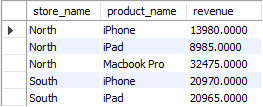

## 3.1 MySQL Table and Column Aliases

A full tutorial is available at [*MySQL Aliases* | MySQL Tutorial](https://www.mysqltutorial.org/mysql-basics/mysql-alias/).

When you work with MySQL tables and table columns, you may find on many occasions that the names of those tables and columns are quite technical and such nomenclature can obfuscate the output of a query. In SQL, you can give tables and columns more descriptive names that make formulating queries easier. This makes working with queries that involve multiple tables easier to formulate and to understand.

 

The general expression for MySQL column alias is:

```mysql
SELECT
[column_1 | expression] AS `descriptive name`
FROM table_name;
```

Consider the following table schema of the employees table from the [classicmodels database](../databases/classicmodels.sql)


*classicmodels database, [https://www.mysqltutorial.org/mysql-basics/mysql-self-join/](https://www.mysqltutorial.org/mysql-basics/mysql-self-join/)*
*Figure 1: table definition for the employees table in the classicmodels database*

Suppose you wish to select a concatenation of employee first and last names from that table. A query to do this could be:

```mysql
USE classicmodels;

SELECT CONCAT_WS (', ', lastName, firstname) 
FROM employees;
```

The column header of the selection output would be “CONCAT_WS (', ', lastName, firstname).” This is an example of where you would want to use an alias for the output column. Reformulate your query to rename the output column to ‘EmployeeName.

```mysql
SELECT CONCAT_WS (', ', lastName, firstname) AS EmployeeName
FROM employees;
```

If you need to order the employee names, then you must use the alias name in the order by clause.

```mysql
SELECT CONCAT_WS (', ', lastName, firstname) AS EmployeeName
FROM employees
ORDER BY EmployeeName;
```

Suppose you wish to select orders whose total amount is less than$1,000 from the classicmodels database. This query makes use of the “GROUP BY” and “HAVING” clauses which will be introduced in a later module, but you should be able to deduce the fundamental meanings of these clauses from the SQL example that follows. Consider the *orders* and *orderdetails* tables from the classicmodels database.


*classicmodels database, [https://www.mysqltutorial.org/mysql-basics/mysql-join/](https://www.mysqltutorial.org/mysql-basics/mysql-join/)*
*Figure 2: table relationship diagram showing the relationship between the orders table and the orderdetails table*

A query using column aliases could be the following:

```mysql
SELECT orderNumber `Order no.`, SUM(priceEach * quantityOrdered) total
FROM orderdetails
GROUP BY `Order no.`
    HAVING total < 1000;
```

Take special note that you cannot use column aliases in *WHERE* clauses.

As with columns, table names can be given aliases.

## 3.2 Overview of Table Joins

In relational databases, multiple tables may be related by a common set of one or more columns. These common columns are known as *foreign key* columns.

Details on foreign keys may be found on the webpage in the [MySQL tutorial](https://www.mysqltutorial.org/mysql-basics/mysql-foreign-key/).

Most queries are formulated using multiple tables. Queries that utilize multiple tables join those tables by matching on foreign keys. MySQL supports the following types of table joins:

- Left join
- Right join
- Inner join
- Cross join.

One should note that Microsoft SQL Server supports additional types of table joins. The following SQL examples demonstrate each type of join. You should try these in MySQL WorkBench. First, create two arbitrary tables that share a common column.

```mysql
CREATE DATABASE IF NOT EXISTS test;
USE test;

DROP TABLE IF EXISTS t1;
DROP TABLE IF EXISTS t2;

CREATE TABLE t1(
    id VARCHAR(4) PRIMARY KEY,
    pattern VARCHAR(25) NOT NULL
);
CREATE TABLE t2(
    id VARCHAR(4) PRIMARY KEY,
    pattern VARCHAR(25) NOT NULL
);
```

Next, populate those two tables with data.

```mysql
INSERT INTO t1(id, pattern)
VALUES ('1','hearts'),
       ('2','diamonds'),
       ('3','clubs');
 
INSERT INTO t2(id, pattern)
VALUES ('A', 'clubs'),
       ('B', 'spades'),
       ('C', 'hearts');
```

### CROSS JOIN

The result set of a CROSS JOIN will be the exhaustive combination of rows from table t1 with the rows of t2. This is known as a *Cartesian Product*.

```mysql
SELECT t1.id, t2.id
FROM t1
CROSS JOIN t2;
```

| t1.id | t2.id |
| :---- | ----- |
| 1     | C     |
| 1     | B     |
| 1     | A     |
| 2     | C     |
| 2     | B     |
| 2     | A     |
| 3     | C     |
| 3     | B     |
| 3     | A     |

### INNER JOIN

The result set of an INNER JOIN will be the selection from both tables where the rows from the two tables have matching column values. The matching criteria is call a join-predicate.

```mysql
SELECT t1.id, t2.id
FROM t1
INNER JOIN t2 
    ON t1.pattern = t2.pattern;
```

The expression *t1.pattern = t2.pattern* is the join predicate.

| t1.id | t2.id |
| :---- | :---- |
| 1     | C     |
| 2     | A     |

### LEFT JOIN

The result set of a *LEFT JOIN* will be the selection from both tables where all rows from the left table are returned. For rows that do not match the join predicate, then NULL values will appear in the columns of the right table.

```mysql
SELECT t1.id, t2.id
FROM t1
LEFT JOIN t2 
    ON t1.pattern = t2.pattern
ORDER BY t1.id
```

| t1.id | t2.id |
| :---- | :---- |
| 1     | C     |
| 2     | NULL  |
| 3     | A     |

### RIGHT JOIN

The result set of a *RIGHT JOIN* will be the selection from both tables where all rows from the right table are returned. For rows that do not match the join predicate, then NULL values will appear in the columns of the left table.

```mysql
SELECT t1.id, t2.id
FROM t1
RIGHT JOIN t2
    ON t1.pattern = t2.pattern
ORDER BY t2.id
```

| t1.id | t2.id |
| :---- | :---- |
| 3     | A     |
| NULL  | B     |
| 1     | C     |

## 3.3 Table Inner Joins

A full tutorial is available at [*MySQL INNER JOIN* | MySQL Tutorial](https://www.mysqltutorial.org/mysql-basics/mysql-inner-join/).

The SQL *INNER JOIN* clause matches rows in one table with rows in other tables. This clause is part of a *SELECT* statement and always follows a *FROM* clause. The form of an INNER JOIN is the following:

```MySQL
SELECT column_list
FROM t1
INNER JOIN t2 ON join_condition1
INNER JOIN t3 ON join_condition2
...
WHERE where_conditions;
```

The following Venn diagram illustrates how the *INNER JOIN* works.


*classicmodels database, https://www.mysqltutorial.org/mysql-basics/mysql-inner-join/*
*Figure 3: A Venn Diagram showing a SQL inner join*

For each row in table t1 the *INNER JOIN* compares a column from t1 to a column in t2 to check if both columns values satisfy the join condition. When the join condition is satisfied then the *INNER JOIN* will return a new row which consist of the selected columns from both t1 and t2. If you join multiple tables that have the same column names then you will have to prefix the columns with the name of the table, or the table’s alias, followed by a “.”.

Consider the following table relationship from the classicmodels database.


*classicmodels database, https://www.mysqltutorial.org/mysql-basics/mysql-inner-join/*
*Figure 4: Table schema and table relationship of the productLines and products tables**

Suppose you want to get the text description for each product code.

```mysql
USE classicmodels;

SELECT productCode, textDescription
FROM products t1
INNER JOIN productlines t2
    ON t1.productline = t2.productline;
```

In this query, note that the products table was given an alias of *t1* and the productLines table was given an alias of *t2*. Since joined columns from both tables have the same name, an alternative query could be:

```MySQL
SELECT productCode, textDescription
FROM products
INNER JOIN productlines 
    USING (productline);
```

Suppose you want the total sales for each order number. A query to do this could be:

```MySQL
SELECT t1.orderNumber, SUM(quantityOrdered * priceEach) total
FROM orders AS t1
INNER JOIN orderdetails AS t2
    ON t1.orderNumber = t2.orderNumber
GROUP BY orderNumber;
```

Suppose you want to find the order price of a product whose code is S10_1678 where the order price is less than the MSRP . A query to do this could be:

```MySQL
SELECT od.orderNumber, p.productName, p.MSRP, od.priceEach
FROM products p
INNER JOIN orderdetails od 
    ON p.productcode = od.productcode
    AND od.priceEach < p.MSRP
        WHERE p.productcode = 'S10_1678';
```

Recommended Video: Jones, J. (2013, January 25). *[Combining multiple tables with a join - Learning Transact-SQL](https://www.linkedin.com/learning/learning-transact-sql/combining-multiple-tables-with-a-join)*. LinkedIn.

## 3.4 Table Left, Right, Cross, and Self Joins

### **1. Left Join**

A full tutorial is available at [*MySQL LEFT JOIN* | MySQL Tutorial](https://www.mysqltutorial.org/mysql-basics/mysql-left-join/).

The SQL *LEFT JOIN* clause matches rows in one table with rows in other tables. This clause is part of a *SELECT* statement and always follows a *FROM* clause. The form of a *LEFT JOIN* is the following:

```MySQL
SELECT table1.column1, table1.column2, table2.column1, table2.column2
FROM table1
LEFT JOIN table2
ON table1.column1 = table2.column1
```

In this query, if a row from the left table, which is table1, matches a row from the right table, which is table2, based on the matching condition *table1.column1 = table2.column1* then that row containing values from the selection columns will be included in the result set. If the row in the left table does not match with the row in the right table, then the row consists of columns from the selection but the data in the rows will be the values in the tuple (table1.column1, table1.column2, NULL, NULL); that is, a null value will appear in each right table column of the result set. A left join result set consists of rows from both left and right tables that are matched plus rows from the left table that are not matched.

The Venn diagram depicts how a left join works. The intersection of the two circles are rows that match both tables and the remaining part of the left circle are rows from the left table that do not have any matching row in the right table.


*classicmodels database, https://www.mysqltutorial.org/mysql-basics/mysql-left-join/*
*Figure 5: A Venn Diagram showing a SQL left join*

Consider the following table schemas and relationship from the classicmodels database.


*classicmodels database, https://www.mysqltutorial.org/mysql-basics/mysql-foreign-key/*
*Figure 6: Table schemas and table relationship of the customers and orders tables*

Suppose you wish to list all customers and any orders they may have as well as the statuses of those orders. Most customers have orders, but many do not. Thus, you will need a left join.

```mysql
USE classicmodels;

SELECT customers.customerNumber, 
       customers.customerName, 
       orderNumber, 
       orders.status
FROM customers
LEFT JOIN orders
    ON customers.customerNumber = orders.customerNumber;
```

Note that the field *orderNumber* does not need to table prefix since that column name is found only in the orders table.

Suppose you wish to find all customers who have no orders. A query to do this could be:

```mysql
SELECT customers.customerNumber,
       customers.customerName,
       orderNumber,
       orders.status
FROM customers
LEFT JOIN orders
    ON customers.customerNumber = orders.customerNumber
    WHERE orderNumber IS NULL;
```

### **2. Right Join**

A full tutorial is available at [*MySQL RIGHT JOIN* | MySQL Tutorial](https://www.mysqltutorial.org/mysql-basics/mysql-right-join/).

The SQL *RIGHT JOIN* clause matches rows in one table with rows in other tables. This clause is part of a *SELECT* statement and always follows a *FROM* clause. The form of a *RIGHT JOIN* is the following:

```mysql
USE classicmodels;

SELECT table1.column1, table1.column2,
       table2.column1, table2.column2
FROM table1
RIGHT JOIN table2
    ON table1.column1 = table2.column1;
```

In this query, if a row from the right table, which is table2, matches a row from the left table, which is table1, based on the matching condition *table1.column1 = table2.column1* then that row containing values from the selection columns will be included in the result set. If the row from the right table does not match with the row from the left table, then the row consists of columns from the selection but the data in the rows will be the values in the tuple (NULL, NULL, table2.column1, table2.column2); that is, a null value will appear in each left table column of the result set. A right join result set consists of rows from both left and right tables that are matched plus rows from the right table that are not matched.

Suppose you wish to query for the sales representative’s name and job title for each customer. Not all customers have a sales representative. Figure 6 (shown in *Left Join* tab) shows the table schema for the customers’ table. Sales representative data are kept in the employees table. Consider the following table schema of the employees table from the classicmodels database.


*classicmodels database, [https://www.mysqltutorial.org/mysql-basics/mysql-self-join/](https://www.mysqltutorial.org/mysql-basics/mysql-self-join/)*
*Figure 7: table definition for the employees table in the classicmodels database*

A query to extract the information you seek could be:

```mysql
SELECT concat (emp.firstname, ' ', emp.lastname) salesPerson, 
       emp.jobTitle,
       customerName
FROM employees emp
RIGHT JOIN customers cust
    ON emp.employeeNumber = cust.salesRepEmployeeNumber
    AND emp.jobTitle = 'Sales Rep';
```

### **3. Cross Join**

A full tutorial is available at [*MySQL CROSS JOIN* | MySQL Tutorial](https://www.mysqltutorial.org/mysql-basics/mysql-cross-join/).

A *CROSS JOIN* returns the Cartesian product of rows from the joined tables. The following SQL statements demonstrate how a cross join works. You should practice this in your Workbench.

First, create the following tables: products, stores, and sales.

```mysql
CREATE DATABASE IF NOT EXISTS salesdb;
USE salesdb;

CREATE TABLE products (
    id INT PRIMARY KEY AUTO_INCREMENT,
    product_name VARCHAR (100),
    price DECIMAL (13, 2)
);
 
CREATE TABLE stores (
    id INT PRIMARY KEY AUTO_INCREMENT,
    store_name VARCHAR (100)
);
 
CREATE TABLE sales (
    product_id INT,
    store_id INT,
    quantity DECIMAL (13, 2) NOT NULL,
    sales_date DATE NOT NULL,
    PRIMARY KEY (product_id, store_id),
    FOREIGN KEY (product_id)
        REFERENCES products (id)
        ON DELETE CASCADE
        ON UPDATE CASCADE,
    FOREIGN KEY (store_id)
        REFERENCES stores (id)
        ON DELETE CASCADE ON UPDATE CASCADE
);
```

Second, see those tables with data.

```mysql
INSERT INTO products (product_name, price)
VALUES ('iPhone', 699),
       ('iPad',599),
       ('Macbook Pro',1299);
 
INSERT INTO stores(store_name)
VALUES ('North'),
       ('South');
 
INSERT INTO sales (store_id, product_id, quantity, sales_date)
VALUES (1,1,20,'2017-01-02'),
       (1,2,15,'2017-01-05'),
       (1,3,25,'2017-01-05'),
       (2,1,30,'2017-01-02'),
       (2,2,35,'2017-01-05');
```

Suppose you want to know the sales of each product at each store. A query to do this could be:

```mysql
SELECT store_name, 
       product_name, 
       SUM(quantity * price) AS revenue
FROM sales
INNER JOIN products
    ON products.id = sales.product_id
INNER JOIN stores
    ON stores.id = sales.store_id
GROUP BY store_name, product_name;
```

The result set is shown in the figure below: 



*classicmodels database, https://www.mysqltutorial.org/mysql-cross-join/*
*Figure 8: Result set of a query extracting the sales of each product at each store*

| store_name | product_name | revenue |
| ---------- | ------------ | ------- |
| North      | iPhone       | 13980   |
| North      | iPad         | 8985    |
| North      | Macbook Pro  | 32475   |
| South      | iPhone       | 20970   |
| South      | iPad         | 20965   |

Suppose you want to include in the result set of the previous query stores that had no sales of a specific product. First, you would want a cross join of all stores and products.

```mysql
SELECT store_name, product_name
FROM stores
CROSS JOIN products
```

Next, you need to join the two queries. A left join is needed as well as a subquery. A subquery represents a table that consists of a row set returned by that subquery. Subqueries are enclosed in parentheses and can be given an alias. A query to list all stores with the sales of each product could be the following:

```mysql
SELECT stores.store_name,
	   products.product_name,
       IFNULL(store_id.revenue, 0) AS revenue
FROM products
CROSS JOIN stores
 LEFT JOIN (SELECT stores.id AS store_id,
            products.id AS product_id,
            store_name,
            product_name,
            ROUND(SUM(quantity * price), 0) AS revenue
            FROM sales
            INNER JOIN products ON products.id = sales.product_id
            INNER JOIN stores ON stores.id = sales.store_id
			GROUP BY stores.id, products.id, store_name , product_name) AS store_id 
                ON store_id.store_id = stores.id
                AND store_id.product_id= products.id
ORDER BY stores.store_name;
```

The output from the query is:

| North | iPhone      | 13980 |
| ----- | ----------- | ----- |
| North | iPad        | 8985  |
| North | Macbook Pro | 32475 |
| South | iPhone      | 20970 |
| South | iPad        | 20965 |
| South | Macbook Pro | 0     |

### **4. Self Join**

A full tutorial is available at [*MySQL Self Join* | MySQL Tutorial](https://www.mysqltutorial.org/mysql-basics/mysql-self-join/).

A self join is used to combine rows with other rows from the same table. A self join requires a table alias. Consider the employees table shown in Figure 7. *(See Right Join tab.)*

Suppose you want to know the names of the employees who report to each manager. A query to do this could be:

```mysql
USE classicmodels;

SELECT CONCAT (m.lastname, ', ', m.firstname) AS 'Manager',
       CONCAT (e.lastname, ', ', e.firstname) AS 'Direct report'
FROM employees e
INNER JOIN  employees m
ON m.employeeNumber = e.reportsto
ORDER BY manager;
```

Suppose you want to list the customers from the customers’ table (Figure 6) who live in the same city. (*See Left Join)*

A query to do this could be the following self join query:

```mysql
SELECT c1.city, c1.customerName, c2.customerName
FROM customers c1
INNER JOIN customers c2
ON  c1.city = c2.city
AND c1.customername > c2.customerName
ORDER BY c1.city;
```
