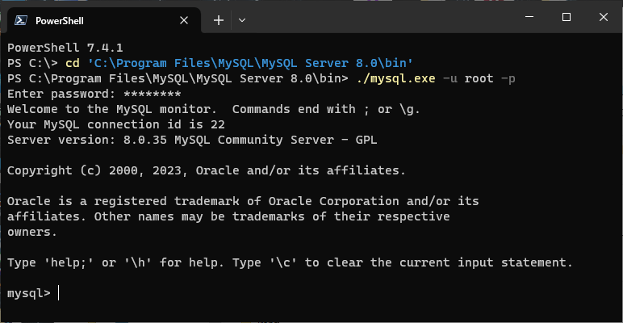
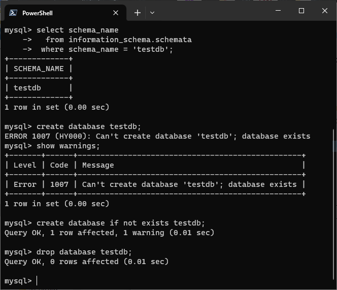
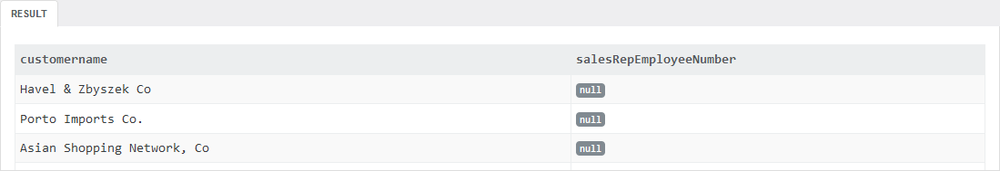
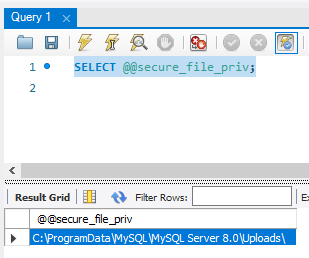
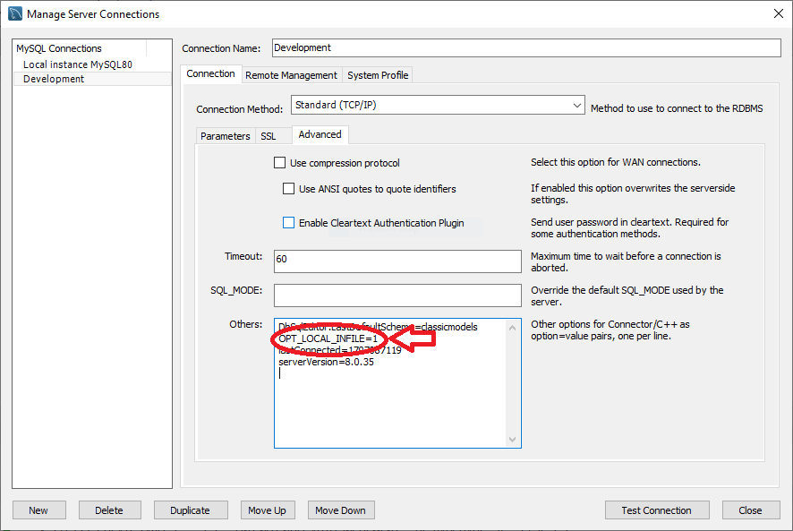
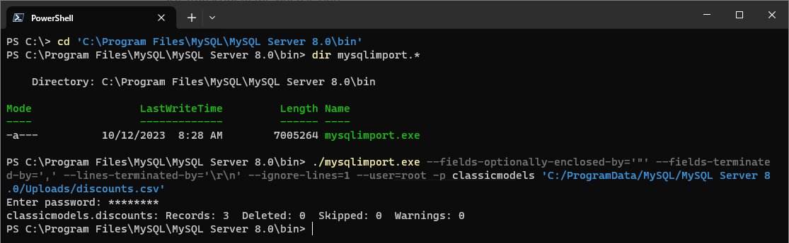
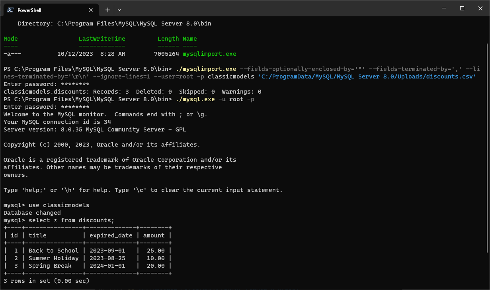

## 4.1a Create Database

A full tutorial is available at [*MySQL CREATE DATABASE* | MySQL Tutorial](https://www.mysqltutorial.org/mysql-basics/mysql-create-database/).

Creating a MySQL database is straightforward. The MySQL syntax for creating a MySQL database is **CREATE DATABASE database_name**. You can do this is in a MySQL command window or by using MySQL  Workbench. 

To connect to the MySQL server using the Command Line Interface (CLI) on a Windows OS as root you may have to navigate to the MySQL /bin/ directory, then enter:

```shell
./mysql.exe -u root -p
```

If you the /bin/ directory is included in your $PATH, or if you are using a Macintosh or Linux OS, you may be able to simply enter:

```shell
mysql -u root -p
```

The following is an example of connecting to a MySQL 8 server installed in the default location on a Windows operating system as the root user:

```shell
cd 'C:\Program Files\MySQL\MySQL Server 8.0\bin'
./mysql.exe -u root -p
```



*Figure 1: Connecting to a MySQL Server using a Command Line Interface (CLI)*

First, you can check for the existence of the database before creating it.

```mysql
mysql> select schema_name
  from information_schema.schemata
 where schema_name = 'testdb';
```

The following example uses the MySQL Command Line Client to  create and modify tables.

```mysql
mysql> create database testdb;
```

This command will throw an error if the database exists. If the result of the previous command has a warning, then explore the warning using the following syntax:

```mysql
mysql> show warnings;
```

 You can also check for the existence of the database before creating it using the following example:

```mysql
mysql> create database if not exists testdb;
```

If you wish to remove a database, do the following:

```mysql
mysql> drop database testdb;
```



*Figure 2: Checking if a database exists and creating a database in MySQL using a Command Line Interface (CLI)*

Ideally, you should specify the character set of your database to  avoid errors that can arise from data streams that have different types  of character formats.

```mysql
mysql> create database if not exists test default character set utf8;
```

## 4.1b Create Table

A full tutorial is available at [*MySQL CREATE TABLE* | MySQL Tutorial](https://www.mysqltutorial.org/mysql-basics/mysql-create-table/).

To create a new table within a database, you use the MySQL **CREATE TABLE** statement. The following illustrates the syntax of the **CREATE TABLE** statement.

```mysql
CREATE TABLE [IF NOT EXISTS] table_name (
                column_list
) engine=table_type
```

The syntax is explained as follows:

1. “table_name” is the name of the table  that you want to create, and the name must be unique. If the table name  is not unique, then MySQL will ignore the statement.
2. *column_list* is the list of columns in the table. Column names are separated by a  comma. Columns are associated with a data type, which will be explained  in the next module.
3. The table storage engine is specified.  Storage engine types include InnoDB, MyISAM, HEAP, EXAMPLE, CSV,  ARCHIVE, MERGE FEDERATED, or NDBCLUSTER. If you don’t declare the  storage engine explicitly, MySQL will use InnoDB by default.

To define a column for a table within the CREATE TABLE command, use the following statement:

```mysql
column_name data_type[size] [NOT NULL | NULL] [Default Value] [Auto_Increment]
```

- The *column_name* specifies the name of the column. Each column has a specific data type and the size (length).
- The NOT NULL or NULL indicates that the column accepts NULL values or does not.
- The DEFAULT *value* is used to specify the default value of the column.
- The AUTO_INCREMENT indicates that the value of the column is increased automatically whenever a new row is inserted into the table. Each table can have only one AUTO_INCREMENT column.

If your table needs a primary key, define the primary key using the syntax:

```mysql
PRIMARY KEY (col1, col2,…)
```

Recommended Video: Moses, M. (2022, June 7). *[Create a Table - MySQL for Non-Programmers](https://www.linkedin.com/learning/mysql-for-non-programmers/create-a-table)*. LinkedIn.

You may need to create the tutorial database before executing the queries in the video:

```mysql
CREATE DATABASE IF NOT EXISTS tutorial;
```

 [SQL transcript of the video lesson](./Moses_02_04_CreateTable.sql)

## 4.2 Insert New Rows

A full tutorial is available at [*MySQL INSERT* | MySQL Tutorial](https://www.mysqltutorial.org/mysql-basics/mysql-insert/).

Let’s create a new table called tasks for practicing the INSERT statement:

```mysql
CREATE DATABASE IF NOT EXISTS test DEFAULT CHARACTER SET utf8;

USE test;

DROP TABLE IF EXISTS tasks;

CREATE TABLE tasks (
  task_id INT AUTO_INCREMENT PRIMARY KEY, 
  title VARCHAR(255) NOT NULL, 
  start_date DATE, 
  due_date DATE, 
  priority TINYINT NOT NULL DEFAULT 3, 
  description TEXT
);
```

To add data to the table, you can use the INSERT command. You can use this command to insert data into a single row or you can use it to add multiple rows to a table as well. The INSERT statement is an  example of Data Manipulation Languages (DML).

The Syntax of MySQL Insert INTO Command:

```mysql
INSERT INTO table_nam(
column1, column2, column3,....... columnN)
VALUES
(value_for_column1, value_for_column2, value_for_column3,.value_for_columnN),
(value_for_column1, value_for_column2, value_for_column3,. value_for_columnN),
…;
```

You should provide the column names only if you are adding  data to those specific columns. You do not need to provide column names – the Insert statement will provide value for all the columns.

### **Inserting dates into a table**

```mysql
INSERT INTO tasks(title, start_date, due_date)
VALUES('Complete Critical Thinking 4', '2024-02-05', '2024-02-11');
```

The above example shows the literal date value into a column, 'YYYY-MM-DD'

In this example,

- YYYY is represented by a year in four digits.
- MM is represented by a month in two digits.
- DD is represented by day in two digits.

You can also use the expression for current date, if that is a requirement over using literal value. The following example will use CURRENT_DATE().

```mysql
SET @due_date := ADDDATE(CURRENT_DATE(), 5);
INSERT INTO tasks(title, start_date, due_date)
VALUES('Complete Interactive Lecture 4', CURRENT_DATE(), @due_date);

SELECT * FROM tasks;
```

Recommended Video: Weinman, B. (2019, July 16). *[Inserting Data - MySQL Essential Training](https://www.linkedin.com/learning/mysql-essential-training-2/inserting-data)*. LinkedIn. For this video, you will use the [scratch](../databases/scratch-mysql.sql) database.

 [SQL transcript of the video lesson](./inserting_data.sql)

## 4.3 Update Existing Rows

A full tutorial is available at [*MySQL UPDATE* | MySQL Tutorial](https://www.mysqltutorial.org/mysql-basics/mysql-update/).

The scripts in this section use the [classicmodels database](../databases/classicmodels.sql) from [MySQLTutorial.org](https://www.mysqltutorial.org/getting-started-with-mysql/mysql-sample-database/).

When you work with data, an important task is that of updating data values. The SQL *UPDATE* command is used to perform those actions. The *UPDATE* statement is used to change column values of a single row, a group of rows, or all rows.

The general syntax of an *UPDATE* statement is:

```mysql
UPDATE [LOW_PRIORITY] [IGNORE] table_name
SET
    column_name1 = expr1,
    column_name2 = expr2,
    ...
WHERE
    condition;
```

The structure of the *UPDATE* statement is as follows:

- The table name must be supplied after the *UPDATE* keyword.

- The 

  SET

   clause  determines which columns will be modified with new data values. When  updating multiple columns, use comma-separated assignment statements. A  value is supplied in each column’s assignment. Values can be:

  - literal,
  - an expression; e.g., a math expression, or
  - a subquery. Subqueries will be introduced in a later module.

- The *WHERE* clause is used to specify which rows need to be updated. This clause is  optional and, if it is not used, then all rows in the table will be  updated.

- The [LOW_PRIORITY] and [IGNORE] options are advanced topics and will not be used in this class.

Consider the first row of the table of the following query:

```mysql
USE classicmodels;

SELECT * FROM employees LIMIT 1;
```

RESULT:

| Employee Number | Last Name | First Name | Extension | Email                        | Office Code | Reports To | Job Title |
| --------------- | --------- | ---------- | --------- | ---------------------------- | ----------- | ---------- | --------- |
| **1002**        | Murphy    | Diane      | X5800     | dmurphy@classicmodelcars.com | 1           | Null       | President |

The table has eight columns: employee number, last name, first name, extension, email, office code, reports to, and job title.

Suppose you wish to change Diane Murphy’s  phone extension from 5800 to 5829 and change her email address to  diane@classicmodelcars.com. To do this, you would execute the following  MySQL *UPDATE* statement in your Workbench.

```mysql
UPDATE employees
SET Extension = 5829, Email = 'diane@classicmodelcars.com'
    WHERE employeeNumber = 1002;
```

You can verify the update statement by running the following *SELECT* statement:

```mysql
SELECT * FROM employees
   WHERE employeeNumber = 1002;
```

The *SET* clause in an *UPDATE* statement can consist of values from a *SELECT* statement that has a result set from other tables. The following example illustrates this key point.

```mysql
SELECT customername, salesRepEmployeeNumber FROM customers
    WHERE salesRepEmployeeNumber IS NULL;
```

A partial result set from this query is shown in the figure below.



*classicmodelcars database, https://www.mysqltutorial.org/tryit/#customers*
*Figure 3: A partial listing of customer who have no sales representative*

To assign a sales representative to a customer, select a random sales representative from the database.

```mysql
SELECT employeeNumber FROM employees
    WHERE jobtitle = 'Sales Rep'
ORDER BY RAND() 
LIMIT 1;
```

Next, you need to assign the selected sales representative’s employee number to a customer where that customer has no sales representative.

```mysql
UPDATE customers
SET salesRepEmployeeNumber = 
    (SELECT employeeNumber FROM employees
        WHERE jobtitle = 'Sales Rep'
        LIMIT 1)
WHERE salesRepEmployeeNumber IS NULL;
```

When you run the following query, then there should be no results:

```mysql
SELECT customername, salesRepEmployeeNumber FROM customers
    WHERE salesRepEmployeeNumber IS NULL;
```

## 4.4 Import Data

When you work with databases, you will have to load data into your database  tables. You may be fortunate enough, however, to have source data in the form of a CSV file that needs to be loaded into a MySQL table. MySQL  provides [LOAD DATA](https://dev.mysql.com/doc/refman/8.0/en/load-data.html) utility, and a command line [mysqlimport](https://dev.mysql.com/doc/refman/8.0/en/mysqlimport.html) utility that allow you to load (import) data.  

In this example, you will import the file [discounts.csv](./discounts.csv) into a discounts table in the classicmodels database.

The contents of [discounts.csv](./discounts.csv) are:

```csv
id,title,expired date,amount
1,Back to School,2023-09-01,25
2,Summer Holiday,2023-08-25,10
3,Spring Break,2024-01-01,20
```

First, create the discounts table in the classicmodels database.

```mysql
USE classicmodels;

DROP TABLE IF EXISTS discounts;

CREATE TABLE discounts (
    id INT NOT NULL AUTO_INCREMENT,
    title VARCHAR(255) NOT NULL,
    expired_date DATE NOT NULL,
    amount DECIMAL(10, 2 ) NULL,
    PRIMARY KEY (id)
);
```

The CSV file must be located in a location allowed by the @@secure_file_priv variable. To determine where files may be imported from, run the query:

```mysql
SELECT @@secure_file_priv;
```



*Figure 4: Finding the path stored in @@secure_file_priv*

In this case, data may only be imported from 'C:\\ProgramData\\MySQL\\MySQL Server 8.0\\Uploads\\'. You can copy the file there using the command prompt, or you may copy the file there using drag-and-drop using a GUI file manager. Note: C:\ProgramData\ is hidden by default on a Windows system, to see the directory in Explorer, from C:\, select 'View' from the menu in Explorer, then check the "Hidden items" checkbox.

Both LOAD DATA and mysqlimport may only import data from a directory specified in the `@@secure_file_priv` variable.

### Using LOAD DATA

A full tutorial for using LOAD DATA is available at [*Import CSV File into MySQL Table* | MySQL Tutorial](https://www.mysqltutorial.org/mysql-basics/import-csv-file-mysql-table/).

In MySQL 8, you may have to add `OPT_LOCAL_INFILE=1` to the Advanced tab for the connection you are using with the Database - Manage Connections menu item and restart the server to load data from a local infile.



*Figure 5. Adding OPT_LOCAL_INFILE=1 to the current connection.*

The syntax for using LOAD DATA to import a CSV file named discounts.csv into the discounts is as follows:

```mysql
SET GLOBAL local_infile=1;  # This may be required for access permissions

LOAD DATA LOCAL INFILE 'C:/ProgramData/MySQL/MySQL Server 8.0/Uploads/discounts.csv'
    INTO TABLE discounts
    FIELDS TERMINATED BY ','
    ENCLOSED BY '"'
    LINES TERMINATED BY '\r\n'
    IGNORE 1 LINES
    (id, title, expired_date, amount);
```

The data will be imported into the discounts table, as defined in the `INTO TABLE discounts` statement.

Each value is enclosed by double quotation marks indicated by the  `ENCLOSED BY '"'`  clause. This prevents a data field value that may  contain a comma (,) from being interpreted as the field separator. 

Each field is separated by a delimiter, in this case a comma, using the `FIELDS TERMINATED BY ','` clause.

Each  line is terminated by a sequence of carriage returns and line feed  characters specified by the `LINES TERMINATED BY '\r\n'` clause. 

The `IGNORE 1 LINES` statement indicates that the first line of the CSV file is a header row  and does not contain data. 

The last line, `(id, title, expired_date, amount);` is a mapping from a column in the CSV file to a table column.  

You may test the import with a SELECT statement:

```mysql
SELECT * FROM discounts;
```

### Using mysqlimport

If you have already imported the data using `LOAD DATA`, DROP and CREATE the discounts table again using the query from the first section.

Using the command line, navigate to the MySQL Server /bin/ directory:

```bat
cd 'C:\Program Files\MySQL\MySQL Server 8.0\bin'
```

Then use mysqlimport to import the data from the CSV file.

For a WINDOWS system:

```bat
./mysqlimport.exe --fields-optionally-enclosed-by='"' --fields-terminated-by=',' --lines-terminated-by='\r\n' --ignore-lines=1 --user=root -p classicmodels 'C:/ProgramData/MySQL/MySQL Server 8.0/Uploads/discounts.csv'
```



*Figure 6. Running mysqlimport on a Windows system.*

For a UNIX system:

```sh
mysqlimport --fields-optionally-enclosed-by='"' --fields-terminated-by=',' --lines-terminated-by='\n' --ignore-lines=1 --user=root -p classicmodels /var/lib/mysql-files/discounts.csv
```

The syntax for loading data as a CSV file named [discounts.csv](./discounts.csv) into the discounts table is:

```mysql
mysqlimport 
  --fields-optionally-enclosed-by='"' 
  --fields-terminated-by=',' 
  --lines-terminated-by='\r\n' 
  --ignore-lines=1 
  --user=root -p classicmodels 'C:/ProgramData/MySQL/MySQL Server 8.0/Uploads/discounts.csv'
```

The mysqlimport command must be **all on one line** with no line breaks.

Each value is enclosed by double quotation marks indicated by the `--fields-optionally-enclosed-by='"'` flag. This prevents a data field value that may  contain a comma (,) from being interpreted as the field separator. 

Each field is separated by a delimiter, in this case a comma, using the `--fields-terminated-by=','` flag.

Each  line is terminated by a sequence of carriage returns and line feed  characters specified by the `--lines-terminated-by='\r\n'` flag. 

The `--ignore-lines=1` flag indicates that the first line of the CSV file is a header row  and does not contain data. 

The `--user=root -p` statement will import the data as the root user and require a password. `classicmodels` is the database to import the data into. `'C:/ProgramData/MySQL/MySQL Server 8.0/Uploads/'` is the directory where the csv file is located, in this case the default secure_file_priv directory of a Windows OS. `discounts.csv` is the name of the file to be imported. IMPORTANT: MySQL determines the table to import the data into based on the filename, so it will import the data from the CSV into the discounts table. Note: The number of columns in the CSV file must match the number of columns in the database table. All blank fields in the CSV file must read `\N` to denote a null value.

You may test the import with a SELECT statement:

```mysql
SELECT * FROM discounts;
```



*Figure 7. Testing a mysqlimport import on a Windows system.*

### Using MySQL Workbench

Recommended Video: Wheeler, B. (2020, August 18). *[Load Bulk Data - Learning MySQL Development](https://www.linkedin.com/learning/learning-mysql-development-2/load-bulk-data)*. LinkedIn. For this video, you will use the [movies_basic](../databases/movies_basic.sql) database and the data from [movies_dataset_basic.csv](./movies_dataset_basic.csv).
