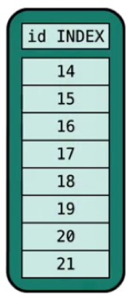
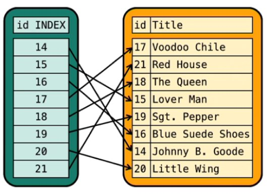
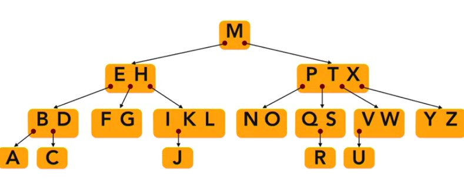
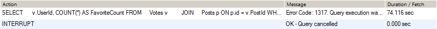
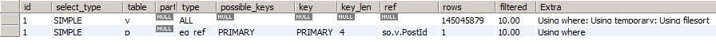
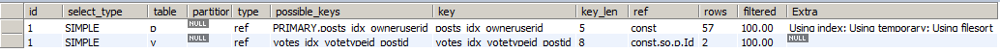
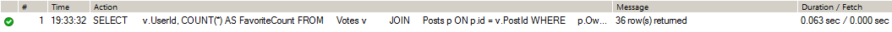

## 7.1 Definition of MySQL Index

In working with databases, you will encounter situations where the number of rows in tables is so large that querying for information from such tables takes an unacceptable amount of time. A database index is a data structure that improves the performance of a query. Indexes are created on table columns and assist with ad-hoc selections by ordering the internal look-up method to table data. An index is a data structure that optimizes searches, sequential access, insertions, and deletions. Like many database systems, MySQL uses indexes to improve performance and to support features that require ordered data.



*Figure 1: A tabular list of indexes that can reference records in a table*

An index keeps a logical order to a set of data. This is a cornerstone of relational database technology. If you want to find a particular row in a table, access to a fast lookup of a unique index key is going to make that very easy to do. Table indexes function similarly to an index in a book.



*Figure 2: An association of indexes to records in a table*

MySQL organizes its indexes as B-trees, as shown in the figure below.



*Figure 3: A B-Tree for the letters of the alphabet*

Imagine you had a list of letters and you wanted to find the letter u. In the list search, you would have to start at one end of the list, compare the first letter to the letter “u” and if it didn't match, then you would look at the next letter and compare it to the letter “u.” This linear search approach is very costly in terms of processing time. Using a “balanced” B-tree, your search for “u” would start by a visit to the letter “m.” Since the letter “u” is “bigger” than “m,” you would follow the arrow to the right leading to the node with the letters “p,” “t,” and “x.” The letter “u” comes between “t” and “x,” so you next follow the arrow between those letters to the node containing the letter “v” and “w.” Now, “u” comes before “v” and so you follow the arrow to the left of “v.” The number of lookups in this fashion is about one-fifth of what is needed in a linear search. B-Trees are very efficient structures for searching, inserting, and deleting nodes (records).

Recommended Video: Sullivan, D. (2023, October 11). *[B-tree indexes](https://www.linkedin.com/learning/advanced-sql-for-query-tuning-and-performance-optimization-22891253/b-tree-indexes)*. LinkedIn. Dan Sullivan, an Enterprise Architect and Big Data Expert, discusses B-Tree indexes.

## 7.2 MySQL Performance Tuning Tips

Part of the job of the database administrator is to tune the database for better performance. Here are some tips for performance tuning.

#### Monitor Wait Time

When queries are submitted to the database from the client, the users have to wait until the query is fully executed before results are displayed. MySQL has provided a way for wait events when a SQL statement is executed. This way, the database administrator can see a clear picture of how long it takes for a query to process. With this information, the database administrator can find the queries that are taking the longest to run and can determine the cause of the slowness.

#### Execution Plan

MySQL has an execution plan built-in. The job of the execution plan is to provide the steps that the database will take when it executes a query. For more information on execution plan, see [*MySQL Explain Example - Explaining MySQL EXPLAIN using StackOverflow data*](#mysql-explain-example).

You will want to consider all the tables that the query will use. Information such as table size will be useful in tuning the query. Use the MySQL-status command to show the information quickly.

#### Objects

You will want to consider all the tables that the query will use. Information such as table size will be useful in tuning the query. Use the MySQL-status command to show the information quickly.

Recommended Video: Sullivan, D, M. (2019, April 1). *[Collect statistics about data in tables](https://www.linkedin.com/learning/advanced-sql-for-query-tuning-and-performance-optimization/collect-statistics-about-data-in-tables)*. LinkedIn. Dan Sullivan discusses collecting statistics and other housekeeping tasks. Now, schemas contain data structures we commonly think of when we think of a database. These include things like tables, indexes, constraints, views, and materialized views. 

## 7.3 Best Practices for Database Security

A database stores critical and confidential data for the organization, so it needs to be protected from external and internal threats. Database administrators must take steps to protect a database from unauthorized access to the data. Let us examine some of the steps that can be taken to endure the security of the database.

- Harding the database – Separate the database from the application and web servers. As a best practice, use n-tier architecture to limit the exposure of the database server.
- Encrypt – Connection to MySQL is not encrypted by default. Encrypt the connections so data is not exposed in cleartext.
- Connection Error – Attackers might try authentication to the database by trying to guess the password. This can be done in the my.cnf file.
- Showdatabase – Disable SHOW DATABASES command. It can be used by attackers to see what databases are running on the server.
- Hardening Script – Run the mysql_secure_installation command to disable services that are not needed.
- Patch – Keep the Operating System patched, and always update the MySQL version.
- Port and Account – MySQL runs on port 3306. Change the port and rename the root account. It reduces the surface attack.
- Audit – Audit the logs and set up alerting when something is not normal.
- Limit access – Only give users the access they need to do their job. Audit the account creation process.


## MySQL Explain Example

### Explaining MySQL EXPLAIN using StackOverflow data

October 1, 2018			
Tomer Shay @ EverSQL 
https://www.eversql.com/mysql-explain-example-explaining-mysql-explain-using-stackoverflow-data/	

I personally believe that the best way to deliver a complicated message to an audience, is by using a simple example. So in this post, I chose to demonstrate how to obtain insights from MySQL's EXPLAIN output, by using a simple SQL query which fetches data from [StackOverflow's publicly available dataset](https://archive.org/details/stackexchange).

The EXPLAIN command provides information about how MySQL executes queries. EXPLAIN can work with SELECT, DELETE, INSERT, REPLACE, and UPDATE statements.

We'll first analyze the original query, then attempt to optimize the query and look into the optimized query's execution plan to see what changed and why.

This is the first article in a series of posts. Each post will walk you through a more advanced SQL query than the previous post, while demonstrating more insights which can be obtained from MySQL's execution plans.

#### The query and database structure

The following is the structure of the two tables used by this example query (*posts* and *votes*):

```MySQL
CREATE TABLE `posts` (
   `Id` int(11) NOT NULL,
   `AcceptedAnswerId` int(11) DEFAULT NULL,
   `AnswerCount` int(11) DEFAULT NULL,
   `Body` longtext CHARACTER SET utf8 NOT NULL,
   ...
   `OwnerUserId` int(11) DEFAULT NULL,
   ...
   `Title` varchar(250) CHARACTER SET utf8 DEFAULT NULL,
   `ViewCount` int(11) NOT NULL
   PRIMARY KEY (`Id`)
 ) ENGINE=InnoDB DEFAULT CHARSET=latin1
```

```MySQL
CREATE TABLE `votes` (
   `Id` int(11) NOT NULL,
   `PostId` int(11) NOT NULL,
   `UserId` int(11) DEFAULT NULL,
   `BountyAmount` int(11) DEFAULT NULL,
   `VoteTypeId` int(11) NOT NULL,
   `CreationDate` datetime NOT NULL,
   PRIMARY KEY (`Id`)
 ) ENGINE=InnoDB DEFAULT CHARSET=latin1
```


The following SQL query will find the details of users who added my StackOverflow questions to their favorites list. For the sake of this example, my user id is *12345678.*

```MySQL
SELECT
  v.UserId,
  COUNT(*) AS FavoriteCount
FROM
  Votes v
  JOIN Posts p ON p.id = v.PostId
WHERE
  p.OwnerUserId = 12345678
  AND v.VoteTypeId = 5  -- (Favorites vote)
GROUP BY
  v.UserId
ORDER BY
  FavoriteCount DESC
LIMIT
  100;
```

The original query's execution duration is very long. I stopped waiting and cancelled the execution after more than a minute has passed.



#### Explaining the original EXPLAIN

This is the original EXPLAIN plan for this query:



Before rushing to optimize the query, let's take a closer look at the output of the EXPLAIN command, to make sure we fully understand all aspects of it. The first thing we notice, is that it can include more than one row. The query we're analyzing involves two tables in the process, which are joined using an inner join. Each of these tables gets represented in a different row in the execution plan above. As an analogy to the coding world, you can look at the concept of an inner join as very similar to a nested loop. MySQL chooses the table it thinks will be best to start the journey with (the outer "loop") and then touches the next table using the values from the outer "loop".

Each of the rows in the EXPLAIN contains the following fields:

- **id** - In most cases, the id field will present a sequential number of the SELECT query this row belongs to. The query above contains no subqueries nor unions, so therefore the id for both rows is 1, as there is actually only 1 query.

- **select_type** - The type of SELECT query. In our case, it's a simple query as it contains no subqueries or unions. In more complex cases, it will contain other types such as SUBQUERY (for subqueries), UNION (second or later statements in a union), DERIVED (a derived table) and others. More information about access_types can be found in [MySQL's docs](https://dev.mysql.com/doc/refman/8.0/en/explain-output.html#explain_type).

- **table** - the table name, or alias, this row refers to. In the screenshot above, you can see 'v' and 'p' mentioned, as those are the aliases defined for the tables *votes* and *posts*.

- **type** - defines how the tables are accessed / joined. The most popular access types you'll generally see are the following, sorted from the worst to the best: ALL, index, range, ref, eq_ref, const, system. As you can see in the EXPLAIN, the table *votes* is the first table accessed, using the ALL access_type, which means MySQL will scan the entire table, using no indexes, so it will go through over 14 million records. The *posts* table is then accessed using the eq_ref access type. Other than the system and const types, eq_ref is the best possible join type. The database will access one row from this table for each combination of rows from the previous tables.

- **possible_keys** - The optional indexes MySQL can choose from, to look up for rows in the table. Some of the indexes in this list can be actually irrelevant, as a result of the execution order MySQL chose. In general, MySQL can use indexes to join tables. Said that, it won't use an index on the first table's join column, as it will go through all of its rows anyway (except rows filtered by the WHERE clause).

- **key** - This column indicates the actual index MySQL decided to use. It doesn't necessarily mean it will use the entire index, as it can choose to use only part of the index, from the left-most side of it.

- **key_len** - This is one of the important columns in the explain output. It indicates the length of the key that MySQL decided to use, in bytes. In the EXPLAIN output above, MySQL uses the entire PRIMARY index (4 bytes). We know that because the only column in the PRIMARY index is Id, which is defined as an INT => 4 bytes. Unfortunately, there is no easier way to figure out which part of the index is used by MySQL, other than aggregating the length of all columns in the index and comparing that to the key_len value.

- **rows** - Indicates the amount of number of rows MySQL believes it must examine from this table, to execute the query. This is only an estimation. Usually, high row counts mean there is room for query optimization.

- **filtered** - The amount of rows unfiltered by the conditions in the WHERE clause. These rows will be joined to the table in the next row of the EXPLAIN plan. As mentioned previously, this is a guesstimate as well, so MySQL can be wrong with this estimation.

- extra

   \- Contains more information about the query processing. Let's look into the extras for our query:

  - using where - The WHERE clause is used to restrict which rows are fetched from the current table (*votes)* and matched with the next table (*posts*).
  - using temporary - As part of the query processing, MySQL has to create a temporary table, which in many cases can result in a performance penalty. In most cases, it will indicate that one of the ORDER BY or GROUP BY clauses is executed without using an index. It can also happen if the GROUP BY and ORDER BY clauses include different columns (or in different order).
  - using filesort - MySQL is forced to perform another pass on the results of the query to sort them. In many cases, this can also result in a performance penalty.

#### Optimizing a slow query using MySQL's EXPLAIN

What can we learn from this specific EXPLAIN plan?

1. MySQL chooses to start with the *votes* table.The EXPLAIN output shows that it has to go through 145,045,878 rows, which is about all the rows in the table. That's nasty.
2. The Extra column indicates that MySQL tries to reduce the amount of rows it inspects using the WHERE clause, but it estimates to reduce those to 10%, which is still bad, as 10% = 14 million rows. A possible conclusion from this information is that the condition *v.VoteTypeId = 5* isn't selective enough, so therefore millions of rows will be joined to the next table.
3. Looking at the WHERE clause, we can see there is another condition, *p.OwnerUserId = 12345678*, which looks very selective and should drastically reduce the amount of rows to inspect. The *posts* table contains ~40 million records, while only 57 rows are returned when applying the condition *p.OwnerUserId = 12345678*, which means that it's very selective. In this case, it would be best if MySQL would have started the execution using the *posts* table, to take advantage of this selective condition. Later in this post, we'll see which change will get MySQL to choose that order.
4. Looking at the *possible_keys* values for both tables, we can see that MySQL doesn't have a lot of optional indexes to choose from. More precisely, there is no index in the possible_keys that contains the columns mentioned in the WHERE clause.

Therefore, we'll add the following two indexes. Each index starts with the column mentioned in the WHERE clause. The index for the *votes* table also includes the joined column.

```mysql
ALTER TABLE `Posts` ADD INDEX `posts_idx_owneruserid` (`OwnerUserId`);
ALTER TABLE `Votes` ADD INDEX `votes_idx_votetypeid_postid` (`VoteTypeId`,`PostId`);
```

#### The optimized query's EXPLAIN output

This is the new EXPLAIN output after adding the indexes:



What changed?

1. The first change we see is that MySQL chose to start with the *posts* table this time (hurray!). It uses the new index to filter out the rows and estimates to filter all but 57 records, which are then joined to the second table, *votes.*
2. The second change we see, by looking at the *key* column, is that indexes are used for lookups and filtering in both tables.
3. By looking at the key_len column, we can see that the composite index for the *votes* table is used in full - 8 bytes, which covers both the VoteTypeId and PostId columns.
4. The last important change we see is the amount of rows MySQL estimates it needs to inspect in order to run evaluate the query. It estimates it needs to inspect 57 * 2 = 114 rows, which is great, comparing to the millions of records in the original execution path.

So looking at the execution duration now, we can see a drastic improvement, from a very slow query which never actually returned, to only 0.063 seconds:



#### Conclusions

Summarizing the most important aspects of reading an EXPLAIN and optimizing this simple query:

1. Run the EXPLAIN command to inspect the planned execution path for your SQL query.
2. Look at the tables order MySQL chose for the execution. Does it makes sense? If not, ask yourself why did MySQL get it wrong, what's missing?
3. Find the conditions in the WHERE clause which are the most selective ones and make sure you create the optimal indexes to include them. You can read more information on [how to create the optimal indexes here](https://www.eversql.com/choosing-the-best-indexes-for-mysql-query-optimization/).
4. Look for the places MySQL doesn't use an index for look-ups and filtering, as those may be the weak spots.
5. Look for the rows where MySQL shows a very high estimation of rows it needs to inspect to evaluate the query.