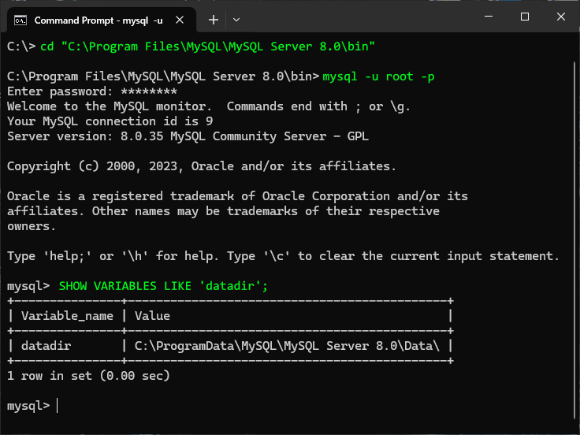

## 8.1 Performing Logical Backups

**A logical backup** creates one or more files containing statements that can be used to reconstruct the database and its data. The files you may have downloaded for the classicmodels database is one example of a logical backup. That file contained commands to create the schema, tables, table relationships, database permissions, and table data. Such backups are portable, meaning they can be restored on any MySQL server instance. Logical backups take longer to create and are slower to restore than other alternative backup protocols.

### **mysqldump**

A tutorial is available at [*MySQL Backup Utility: mysqldump* | MySQL Tutorial](https://www.mysqltutorial.org/mysql-administration/mysqldump/).

The command-line utility mysqldump that is included with MySQL may be used to create logical backups. The program communicates with the server to retrieve data and write out various statements capable of rebuilding the database. To make sure no changes are made during the backup process, you will need to lock the tables with a “read lock” which makes the database read-only. Follow these steps to make a logical backup of the classicmodels database using mysqldump:

- In the command-line client, make sure the classicmodels database is the active database and issue a FLUSH TABLES statement so any pending operations are completed and the lock is established. The command syntax is:

```MySQL
FLUSH TABLES WITH READ LOCK;
```

- In Windows, open a second command prompt. In that prompt, invoke the mysqldump as follows:

```shell
mysqldump -u root -p > classicmodels.sql
```

You will be prompted for the root password. Once the dump is completed, return to the MySQL command-line client and unlock the tables.

```mysql
UNLOCK TABLES;
```

The *mysqldump* utility contains numerous run-time options which you may need. To list all of the options, run *mysqldump* -? in a MySQL command client window.
| Learn More: |
| ------------------------------------------------------------ |
| *--add-drop-table*    Use this option to include a DROP TABLE statement before any CREATE TABLE statements in the output. If you don’t drop a table first, then the import process will fail on the CREATE TABLE statement when the backup is restored on a system |
| *--disable-keys*    Recall from [Module 7](../InteractiveLecture7/interactive_lecture_7_notes.md) that if you have indexes and/or keys on a table then the insertion of data into that table is slower because the insertion process has to update the table indexes in addition to inserting table. Index updating is complex because it involves having to balance a B-tree. The disable-keys option adds a statement that disables indexes and keys before INSERT statements and another statement afterwards to re-enable them. This can help speed up large imports because MySQL can record its indexes all at once instead of after each INSERT. |
| *--tables*    This option is used to back up only specific tables instead of all tables in a database. Any values after the option are treated as table names. |
| *--where*    This option is used to backup certain rows from tables using a WHERE condition. For example, `--tables customer --where contactName LIKE 'B%'` will only export rows from the customers table for contacts whose last name starts with B. |

Whenever you perform a database backup, a good administrative practice is to restore the backup so that you know your backup worked. If you have the resources, on another computer install MySQL and then run the following commands:

```shell
mysql -u root -p -e ‘CREATE DATABASE classicmodels’
mysql -u root -p < classicmodels-backup.sql
```

Verify that you have a second copy of your database. Another way to make logical backups is to issue a SELECT statement and redirect the selected data to a file using INTO OUTFILE. This approach backs up a table’s data but not the table definition.

```MySQL
SELECT * from customers INTO OUTFILE 'C:\ITS410\Mod8\customers.txt';
```

The output file can only be created on the host running MySQL and not on a networked drive. If you need to load the data, then use the following command:

```MySQL
LOAD DATA INFILE 'C:\ITS410\Mod8\customers.txt' INTO TABLE customers;
```

When loading data in this fashion, there is a potential for primary key conflicts or duplicating rows if data already exist in the table, so caution must be exercised when using this command.

## 8.2 Performing Physical Backups

A physical backup is a raw copy of the files and directories managed by MySQL. Generating a physical backup is faster than a logical backup because it is a copy operation. A drawback to a physical backup is that it cannot capture data that hasn’t been written to disk. For example, if a table is managed by the MEMORY storage engine then the data are kept in RAM, so there is no file to copy. Also, physical backups are less portable, and can only be restored to a similar system. A backup taken as an LVM (Logical Volume Manager) snapshot on a Linux server cannot be restored to a Windows system.

Before you can make a physical backup, you need to identify the directory that MySQL stores your data in. Inspecting the global system variable datadir will tell you the location. On a Windows system, execute the following commands:

```bat
cd "C:\Program Files\MySQL\MySQL Server 8.0\bin"
mysql -u root -p
<enter the root password>
SHOW VARIABLES LIKE 'datadir';
exit;
```

On a Linux system, omit the cd command.



*Figure 1: Querying the value for the MySQL variable datadir*

The same details in Figure 1 above are listed below:

```
SHOW VARIABLES LIKE 'datadir';
+---------------+---------------------------------------------+
| Variable_name | Value                                       |
+---------------+---------------------------------------------+
| datadir       | C:\ProgramData\MySQL\MySQL Server 8.0\Data\ |
+---------------+---------------------------------------------+
```

Inside the data directory are separate directories for each of the databases that MySQL manages. MyISAM data storage includes both table definitions and the data. Data in InnoDB-managed tables, regardless of database, are stored in idbdata files in the base data directory.

This Windows batch file [[backupmysql.bat](./backupmysql.bat)] will create a physical backup for your MySQL databases in a folder on the desktop. This batch file requires the [7-Zip archive utility](https://www.7-zip.org/download.html) to be installed. The batch file needs to be executed using the command line (CMD) in administrator mode. It will not run in PowerShell.

To run the batch file, run CMD as administrator, cd to the directory the batch file is in and enter:

```
backupmysql.bat root <type the root password>
```

The Windows batch file is detailed below:

```bat
@echo off
:: Use command line arguments as login and password.
set dbUser=%1
set dbPassword=%2

:: Create the backup directory if it does not exist.
if not exist "%userprofile%\desktop\backup" mkdir %userprofile%\desktop\backup
if not exist "%userprofile%\desktop\backup\mysql" mkdir %userprofile%\desktop\backup\mysql

:: Identify the directories that will be used.
set backupDir="%userprofile%\desktop\backup\mysql"
set mysqldump="C:\Program Files\MySQL\MySQL Workbench 8.0\mysqldump.exe"
set mysqlDataDir="C:\ProgramData\MySQL\MySQL Server 8.0\Data\"
set zip="C:\Program Files\7-Zip\7z.exe"

:: Get the date and time.
for /f "tokens=2 delims==" %%a in ('wmic OS Get localdatetime /value') do set "dt=%%a"
    set "YYYY=%dt:~0,4%"
    set "MM=%dt:~4,2%"
    set "DD=%dt:~6,2%"
    set "hh=%dt:~8,2%"
    set "min=%dt:~10,2%"

:: Identify the backup directory.
set dirName=%YYYY%%MM%%DD%_%hh%%min%

:: Create the backup directory.
if not exist %backupDir%\%dirName%\ mkdir %backupDir%\%dirName%

:: switch to the "data" folder.
pushd %mysqlDataDir%
:: iterate over the folder structure in the "data" folder to get the databases.
for /d %%f in (*) do (
    :: Save the database file to the backup directory.
    %mysqldump% --host="localhost" --user=%dbUser% --single-transaction --add-drop-table --databases --password=%dbPassword%  %%f > %backupDir%\%dirName%\%%f.sql
    :: Compress the backup file to a gunzip file.
    %zip% a -tzip %backupDir%\%dirName%\%%f.sql.gz %backupDir%\%dirName%\%%f.sql
    :: Delete the uncompressed file.
    del %backupDir%\%dirName%\%%f.sql
)

:: Return to the present working directory and pause to show output.
popd
pause
```

The backup medium can any type that suits your needs. If you are a developer and you need to back up a personal dev environment, then you might copy your MySQL files to an external hard drive. If you are working in an enterprise setting, then your backup might be saved to a SAN, and later copied to high-capacity tape and shipped to an off-site storage facility.

Once you have your backup completed then you should validate your backup by restoring it to another location.

## 8.3 Introducing Database Replication

**Replication** is the ability for one or more **slave** servers to maintain a copy of another MySQL server’s data. With replication enabled, when you add, update, and delete rows in the master server’s database, details about the event are recorded to a special log file. The slaves then retrieve the logged details and repeat events to maintain their own local copy of the database, in near real time. A **master** server doesn’t wait for each slave to process an event; each slave is responsible for itself. That is, replication is an asynchronous process. Slave servers track their current position in the log, so you can bring a slave down for maintenance and it will continue processing from the point it left off when you bring it back online.

Replication is useful in many different situations: 

- **Backups:** You can stop replication on a slave server and make a physical backup of its data without affecting the availability of the master.
- **Redundancy:** If a full copy of the database is maintained on a slave, the master can be swapped out with a slave with little effort in failover or disaster-recovery scenarios.
- **Scalability and Performance:** In heavy-load environments, write operations can be issued against the master, while read operations can be executed against read-only slaves, fanned out behind a load balancer.

There are three ways an event can be recorded in the log file: *statement-based*, *row-based*, and *mixed-format logging*. The default is *statement-based logging*.

1. Statement-based logging records SQL statements that the slave will execute.
2. Row-based logging writes details about every change a database event effected.
3. Mixed-format logging records SQL statements for most events, but switches to change details under certain circumstances.

### **Setting up Replication**

*todo test the following, check against https://webyog.com/blog/monyog/setting-basic-master-slave-replication-mysql-8/*

The following steps guide you through the process of configuring MySQL replication with one master and one slave. To complete the steps, you’ll need two machines with MySQL installed—one which you will designate as the master and another as the slave.

- Locate MySQL’s configuration file on each system. The file is named my.cnf on Linux systems and is normally located in the /etc/mysql/ directory. On Windows, it’s named my.ini, and is normally located in the hidden directory "C:\ProgramData\MySQL\MySQL Server 8.0\\". OSX normally provides sample configuration files in /usr/local/mysql/support-files/ that must be manually configured and copied to /etc/ .
- Edit the master server’s configuration file. If a configuration entry you want is commented out with a leading #, enable it by deleting the character. If the entry doesn’t exist, add it under the [mysqld] section. The entries of interest are: 

**server-id:** Identifies the server in the replication setup. It should be active (uncommented) and given a positive integer value unique between all servers in the group.

**log_bin:** Identifies the base name (no file extension) of the replication log file.

**binlog_do_db:** Identifies which databases will be logged for replication. Multiple databases can be listed, separated by spaces. This entry should be active.

**skip_networking** or **bind-address:** These entries configure whether MySQL accepts connections from the outside world or not. If skip_neworking is enabled, or bind-address is set to a value like 127.0.0.1, then the master rejects the slave's connection attempts. Leave these entries commented out.

- Save your changes to the master’s configuration file and restart its MySQL instance.
- Connect to the master with the command-line client using the root user to create a new user account for the slave to use. Configure the slave to use this account to receive the replication details:

```MySQL
CREATE USER 'repluser'@'%' IDENTIFIED BY 'P@$$w0rd';
GRANT REPLICATION SLAVE ON *.* TO 'repluser'@'%';
FLUSH PRIVILEGES;
```

- Take a backup of the master’s database. You will use the backup to populate the slave to ensure it starts out in sync with the master.

​    a. Lock the active databases tables:

```MySQL
FLUSH TABLES WITH READ LOCK;
```

​    b. Execute the dump command in a new terminal:

```shell
mysqldump -u root -p classicmodels > classicmodels-backup.sql
```

​    c. Return to the command-line client and release the lock:

```MySQL
UNLOCK TABLES;
```

- Issue a `SHOW MASTER STATUS` statement to get information about the current state of the master. Remember the values the master reports back because you will need them to configure the slave:
- Copy the master’s backup file—made in step 5—over to the slave.
- On the slave, create the classicmodels database and import the backup file:

```shell
mysql -u root -p -e ‘CREATE DATABASE classicmodels’
mysql -u root -p < classicmodels-backup.sql
```

- Open the slave server’s configuration file and set the server-id value. Remember, the value must be unique among all servers in the replication group.
- Save the change to the configuration file and restart the slave MySQL instance.
- With the command-line client, connect to the slave, and send the statement SHOW SLAVE STATUS\G to make sure its replication process is not running. If any of the values of *Slave_IO_Running* and *Slave_SQL_Running* are “Yes,” issue STOP SLAVE;.
- Send the following statement to the slave so as to configure it to communicate with the master:

```MySQL
CHANGE MASTER TO
    MASTER_HOST = '192.168.1.100',
    MASTER_USER = 'repluser',
    MASTER_PASSWORD = 'P@$$w0rd',
    MASTER_LOG_FILE = 'mysql-bin.000001',
    MASTER_LOG_POS = 107;
```

The MASTER_HOST value is the address of your master server,

MASTER_USER and MASTER_PASSWORD are the credentials for the newly created replication account,

MASTER_LOG_FILE and MASTER_LOG_POS indicate the current state of the master’s log file as returned by the earlier SHOW MASTER STATUS statement.

- Start the slave’s replication process by sending START SLAVE;.
- Verify that replication is running with a SHOW SLAVE STATUS statement. The values of *Slave_IO_Running and Slave_SQL_Runnin*g should now both be “Yes.”
- Test that replication is working by making an update or inserting a new row on the master and checking the slave to see if the change propagated automatically.