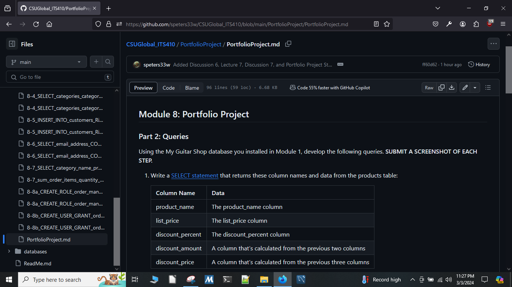

# Portfolio Project

Stephan Peters

Colorado State University Global

ITS410-2 23WC: Database Management

Jamia Mills

10 March 2024

## Part Two: Queries

### Step 1

This query returns the product name, the list price, the discount percent, the discount amount, and the discount price from the my guitar shop products table and limits the results to five lines and sorts the results in descending order:

#### Source Code 1

*Source code for step 1.*

```MySQL
USE my_guitar_shop;
SELECT product_name, list_price, discount_percent, 
    ROUND((list_price * discount_percent * .01), 2) AS discount_amount, 
    ROUND((list_price - (list_price * discount_percent * .01)), 2) AS discount_price
FROM products
ORDER BY discount_price DESC
LIMIT 5;
```

#### Screenshot 1

*Screenshot of Execution for step 1.*


### Step 2

This query returns the item id, the item price, the discount amount, the quantity, the total price, the discount total, and the item total from the my guitar shop products table and limits the results to where the item total is over $500, sorted in descending order:

#### Source Code 2

*Source code for step 2.*

```MySQL
USE my_guitar_shop;

SELECT item_id, item_price, discount_amount, quantity,
    (item_price * quantity) AS price_total,
    (discount_amount * quantity) AS discount_total,
    item_total(item_id) AS item_total
        FROM order_items
            WHERE item_total(item_id) > 500
ORDER BY item_total DESC;
```

​    

#### Screenshot 2

*Screenshot of Execution for step 2.*


### Step 3

This query returns the product name and list price from the my guitar shop products table where the list price is identical to the list price of another product:

#### Source Code 3

*Source code for step 3.*

```MySQL
USE my_guitar_shop;

SELECT product_name, list_price FROM products
    WHERE list_price IN (
        SELECT list_price FROM products
        GROUP BY list_price 
            HAVING count(list_price) > 1
);
```

#### Screenshot 3

*Screenshot of Execution for step 3.*


### Step 4

This query returns the category name from the categories table, and the product id from the products table of the my guitar workshop database where the category name is not used:

#### Source Code 4

*Source code for step 4.*

```MySQL
USE my_guitar_shop;

SELECT c.category_name, p.product_id FROM categories c
LEFT JOIN products p USING (category_id)
    WHERE p.product_id IS NULL
UNION ALL
SELECT c.category_name, p.product_id FROM categories c
RIGHT JOIN products p USING (category_id)
    WHERE p.product_id IS NULL;
```

#### Screenshot 4

*Screenshot of Execution for step 4.*


### Step 5

These queries add the following customer to the customers table in the my guitar workshop database Rick Raven, rick@raven.com, and verify the insertion:

#### Source Code 5

*Source code for step 5.*

```MySQL
USE my_guitar_shop;

INSERT INTO customers(email_address, password, first_name, last_name) 
VALUES ('rick@raven.com', '', 'Rick', 'Raven');

SELECT * FROM customers
    WHERE email_address = 'rick@raven.com';
```

#### Screenshot 5

*Screenshot of Execution for step 5.*


### Step 6

This query returns the email address and the number of distinct products the customer ordered for only customers that have ordered more than one product, sorted by email address:

#### Source Code 6

*Source code for step 6.*

```MySQL
USE my_guitar_shop;

SELECT c.email_address, COUNT(DISTINCT oi.product_id) AS count
FROM customers c
INNER JOIN orders o ON c.customer_id = o.customer_id
INNER JOIN order_items oi ON o.order_id = oi.order_id
    GROUP BY c.email_address
        HAVING count > 1
ORDER BY c.email_address;
```

#### Screenshot 6

*Screenshot of Execution for step 6.*


### Step 7 

This script returns the category name from the categories table, the product name from the products table, and the total quantity purchased from the order items table that displays the total quantity purchased for each product within each category with all null values replaced with literal values:

#### Source Code 7

*Source code for step 7.*

```MySQL
USE my_guitar_shop;

DROP TABLE IF EXISTS total_quantity_purchased;
CREATE TEMPORARY TABLE total_quantity_purchased
SELECT c.category_name, p.product_name, sum(oi.quantity) AS total_quantity
FROM products p
JOIN order_items oi USING (product_id)
JOIN categories c USING (category_id)
    GROUP BY oi.product_id;
        
ALTER TABLE total_quantity_purchased
ADD PRIMARY KEY(product_name);

INSERT IGNORE INTO total_quantity_purchased (
                       product_name, 
                       category_name, 
                       total_quantity
)
SELECT p.product_name, c.category_name, 0 FROM products p
JOIN categories c USING (category_id);

SELECT * FROM total_quantity_purchased
ORDER BY category_name;
```

   

Screenshot 7a shows the resulting table from the first query in the script, which returns the category name, product name, and total number ordered of each product in inventory that has had any sales in order items. Screenshot 7b shows the total number of products sold in each category that has products in inventory. 

#### Screenshot 7a

*Screenshot of number of categories and products sold for each product.*


#### Screenshot 7b

*Screenshot of number products sold in each category.*


### Step 8

The script in Source Code 8a creates an order manager role that grants the following privileges for the my guitar shop database to a user with this role:

·     SELECT, INSERT, UPDATE, and DELETE privileges for the customers, addresses, orders, and order_items tables.

·     SELECT privileges for the products and categories tables.

·     No GRANT privileges to other users.

#### Source Code 8a

*Source code for step 8a.*

```MySQL
USE my_guitar_shop;

DROP ROLE IF EXISTS 'order_manager';
CREATE ROLE IF NOT EXISTS 'order_manager';

REVOKE USAGE ON *.* FROM order_manager;

GRANT SELECT, INSERT, UPDATE, DELETE
ON my_guitar_shop.customers
TO 'order_manager';

GRANT SELECT, INSERT, UPDATE, DELETE
ON my_guitar_shop.addresses
TO 'order_manager';

GRANT SELECT, INSERT, UPDATE, DELETE
ON my_guitar_shop.orders
TO 'order_manager';

GRANT SELECT, INSERT, UPDATE, DELETE
ON my_guitar_shop.order_items
TO 'order_manager';

GRANT SELECT
ON my_guitar_shop.products
TO 'order_manager';

GRANT SELECT
ON my_guitar_shop.categories
TO 'order_manager';
```


#### Screenshot 8a

*Screenshot of creating a user role for step 8.*


The script in Source Code 8b creates a user named speters33w with the order manager role and all privileges and restrictions of the order manager role:

#### Source Code 8b

*Source code for step 8b.*

```MySQL
USE my_guitar_shop;
DROP USER IF EXISTS speters33w;

CREATE USER 'speters33w' IDENTIFIED BY 'sesame80';

GRANT order_manager TO speters33w;

SHOW GRANTS FOR speters33w;
SHOW GRANTS FOR order_manager;

```

### Screenshot 8b

*Screenshot of creating a user with the order manager role for step 8.*


### GitHub Repository

In addition to the solutions above, I created a GitHub repository for the project. This repository is located at https://github.com/speters33w/CSUGlobal_ITS410/blob/main/PortfolioProject/PortfolioProject.md

Figure 9 shows a screenshot of the markdown file for the portfolio project of this repository.

### Figure 9

*Screenshot of the portfolio project page of my ITS 410 GitHub repository*




 