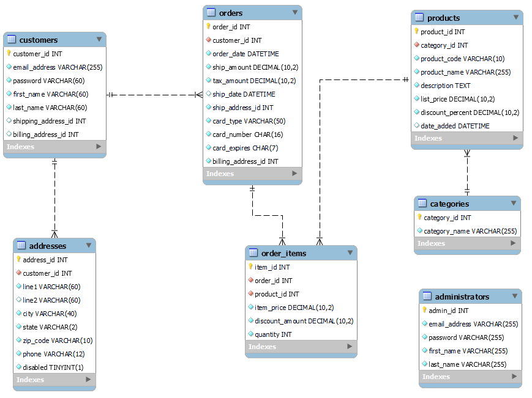

# CSU Global ITS410 Database Management (MySQL) 23WC 

This repository contains my solutions while taking ITS410 Database Management from Colorado State University, Global Campus.

## Interactive Lecture Scripts

Some of the Interactive Lecture scripts in this repository require using the October, 2023 version of the [classiccars](https://www.mysqltutorial.org/wp-content/uploads/2023/10/mysqlsampledatabase.zip) database from [mysqltutorial.org](https://www.mysqltutorial.org/).

Module 1 Getting Started with MySQL Database

[Module 2](./InteractiveLecture2/interactive_lecture_2_scripts.sql) MySQL Data Types and Retrieving Data

Module 3 Retrieve Data from Multiple Tables

Module 4 Insert, Update and Delete Table

[Module 5](./InteractiveLecture5/interactive_lecture_5_scripts.sql) Grouping and Summarizing Data

Module 6 Stored Procedures and Functions

Module 7 Database Tuning and Security

Module 8 Backup and Recovery

## Critical Thinking Assignments

The Critical Thinking scripts in this repository require using the CSU Global 2023 Winter C version of the [my_guitar_shop](./my_guitar_shop.sql) database.

[Module 1](./CriticalThinking1/Module_1_Critical_Thinking.md) Creating a MySQL Database

[Module 2](./CriticalThinking2/Module_2_Critical_Thinking.md) The Guitar Shop database

[Module 3](./CriticalThinking3/Module_3_Critical_Thinking.md) Using Joins

[Module 4](././CriticalThinking4/Module_4_Critical_Thinking.md) Modifying Tables

[Module 5](././CriticalThinking5/Module_5_Critical_Thinking.md) Writing Queries

Module 6 Stored Procedures

Portfolio Project  (Part 2, Queries)

